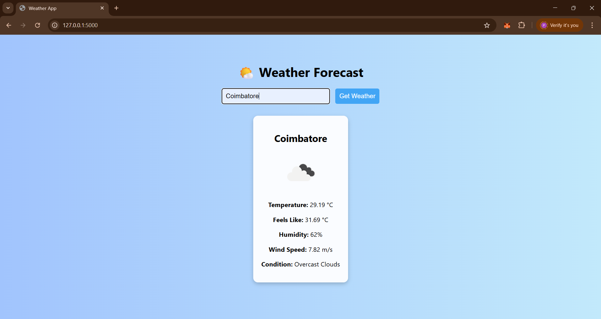

# 🌤️ Flask Weather App


A simple, beautiful weather forecasting web app built using **Flask** and the **OpenWeatherMap API**. Enter any city name and get real-time weather updates, including temperature, condition, humidity, wind speed, and more — all with live weather icons. ☀️🌧️🌪️

---

## 🌐 Demo



---

## 🚀 Features

- 🔍 Search weather by **city name**
- 📡 Real-time weather data from OpenWeatherMap API
- 📊 Shows:
  - Temperature (°C)
  - Feels Like
  - Weather Condition
  - Humidity
  - Wind Speed
- 🌐 Weather icons dynamically loaded
- 💅 Clean, responsive UI
- 🔐 Secure API key using `.env`

---

## 🛠️ Tech Stack

- **Python** 🐍
- **Flask** 🔥
- **HTML5 & CSS3**
- **OpenWeatherMap API**

---

## 📦 Installation & Setup

### 1. Clone the repo

```bash
git clone https://github.com/prathikshaj1203/flask-weather-app.git
cd flask-weather-app
2. Create a virtual environment (optional but recommended)
bash
Copy
Edit
python -m venv venv
source venv/bin/activate  # for Linux/Mac
venv\Scripts\activate     # for Windows
3. Install dependencies
bash
Copy
Edit
pip install -r requirements.txt
4. Create a .env file
Create a .env file in the root folder and add your API key:

env
Copy
Edit
WEATHER_API_KEY=your_openweathermap_api_key_here
✅ You can get a free API key from https://openweathermap.org/api

5. Run the app
bash
Copy
Edit
python app.py
Open your browser and go to: http://localhost:5000

📁 Project Structure
vbnet
Copy
Edit
flask-weather-app/
│
├── app.py
├── .env
├── .gitignore
├── requirements.txt
├── templates/
│   └── index.html
├── static/ (optional, for custom CSS/images)
└── screenshots/
    └── weather-light.png
🖼️ Screenshots
🌤️ Weather Display:

🛡️ Security
Your API key is stored in a .env file and excluded from Git using .gitignore.

A sample .env.example is provided for collaborators.

env
Copy
Edit
# .env.example
WEATHER_API_KEY=your_api_key_here
🌍 Future Improvements
Add 5-day or 7-day forecast

Detect user’s location via IP or geolocation

Add dark mode 🌙

Deploy on Render, Railway, or Vercel

💖 Credits
Weather data: OpenWeatherMap

UI design inspired by simple UX principles

📜 License
This project is open-source and available under the MIT License.

Made with ☕ & 🌦️ by Prathiksha J
